# Задание 1. Анализ и планирование

### 1. Описание функциональности монолитного приложения

**Управление отоплением:**

- Пользователи могут регистрировать датчики.
- Пользователи могут: для температурных датчиков получать данные о температуре в реальном времени, для остальных - возможность задавать значение датчиков самостоятельно и считывать его позже.

**Мониторинг температуры:**

- Пользователи могут получать данные о температуре в реальном времени.

### 2. Анализ архитектуры монолитного приложения

Язык программирования: Go.

База данных: PostgreSQL.

Архитектура: Монолитная, все компоненты системы (обработка запросов, бизнес-логика, работа с данными) находятся в рамках одного приложения.

Взаимодействие: Синхронное.

Масштабируемость:
- Сервис сенсоров можно масштабировать путем запуска копий сервиса, так как он stateless.
- БД не масштабируется, так как не предусмотрен шардинг.

Развертывание: Требует остановки всего приложения.

### 3. Определение доменов и границы контекстов

- Домен: управление датчиками.
	- Контекст: регистрация датчиков.
	- Контекст: хранение значений датчиков.
- Домен: датчики температуры.
	- Контекст: измерение температуры.

### **4. Проблемы монолитного решения**

- Любой запрос проксируется в датчик температуры, что не очень хорошо, потому что запрос в датчик может долго отрабатывать, и соединение может внезапно прерваться.
- Сложно разрабатывать несколькими командами.
- Неудобно релизить.

### 5. Визуализация контекста системы — диаграмма С4

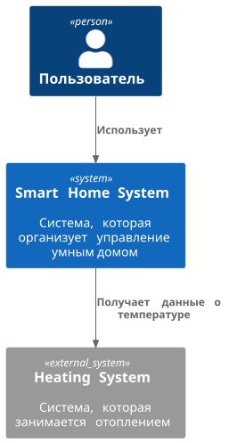

# Задание 2. Проектирование микросервисной архитектуры

**Диаграмма контейнеров (Containers)**

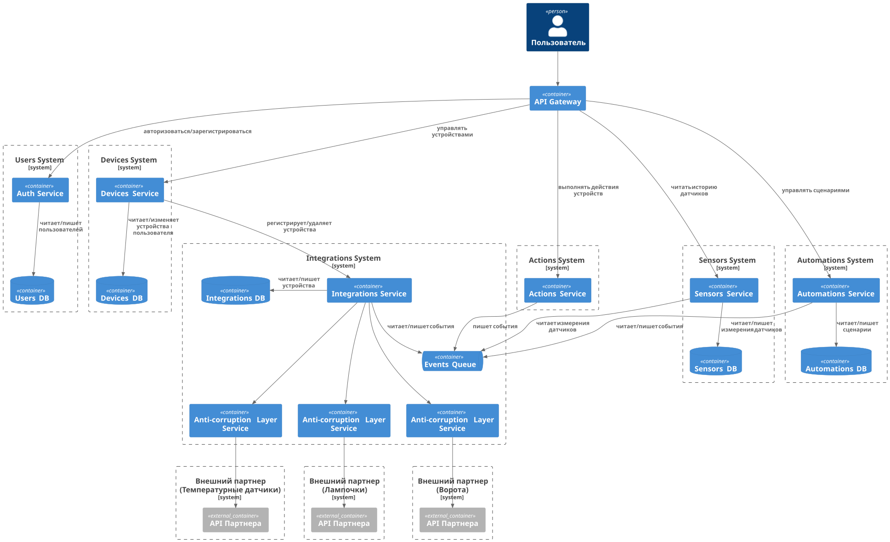

**Диаграмма компонентов (Components)**

Auth Service:

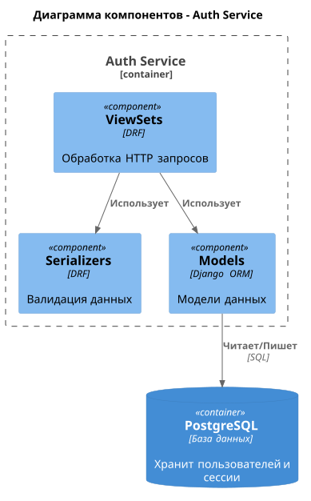

 

Devices Service:

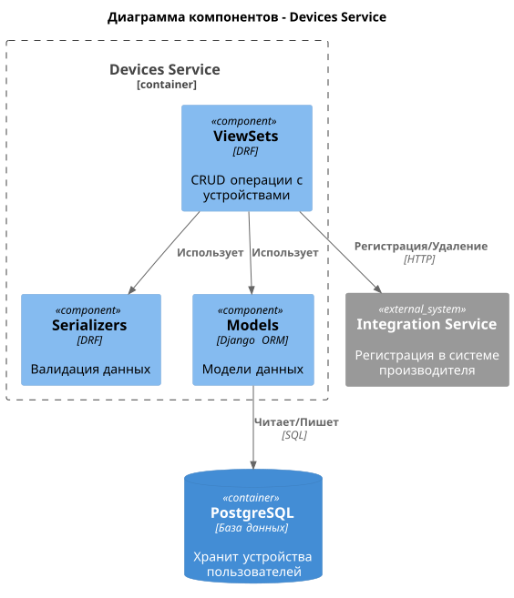

 

Actions Service:

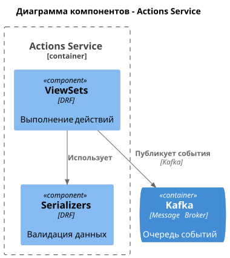

 

Automations Service:

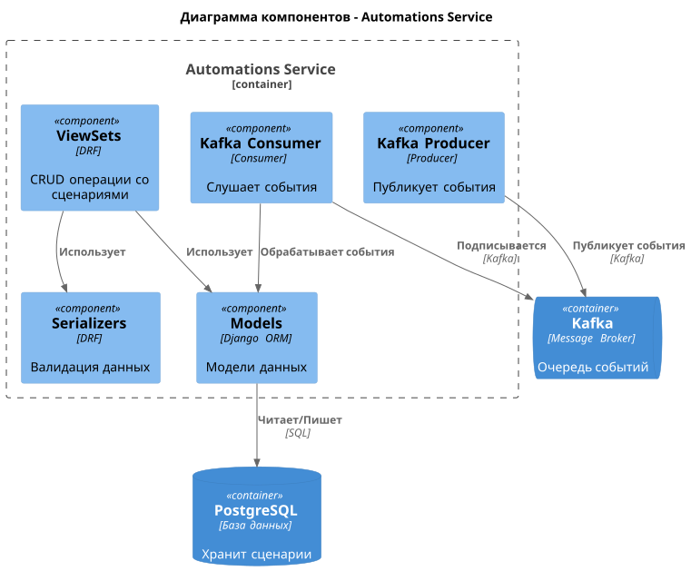

 

Sensors Service:

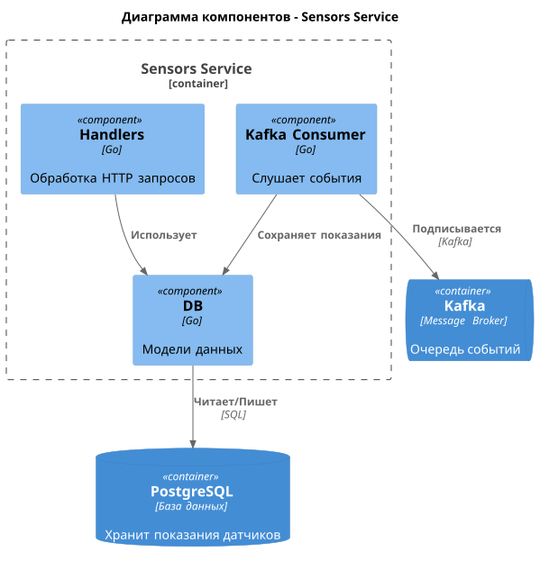

 

Integration Service:

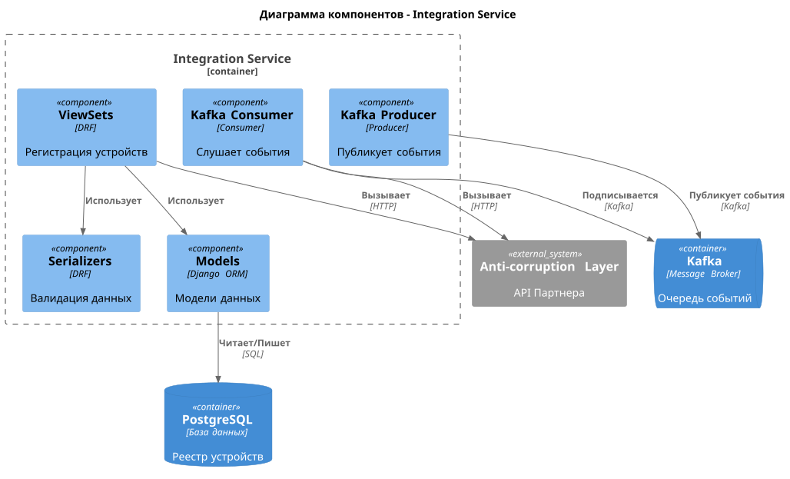

 

**Диаграмма кода (Code)**

Auth Service - структура классов Django REST Framework:

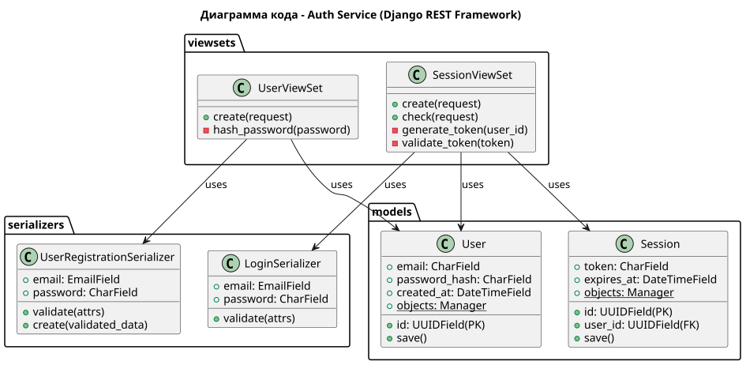

 

# Задание 3. Разработка ER-диаграммы

Auth Service ER-диаграмма:

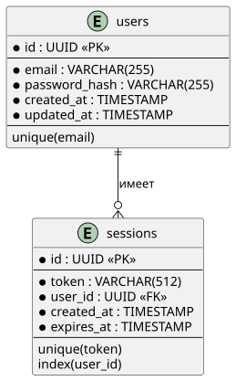

 

Devices Service ER-диаграмма:

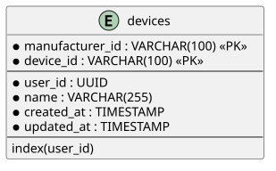

 

Automations Service ER-диаграмма:

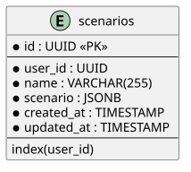

 

Sensors Service ER-диаграмма:

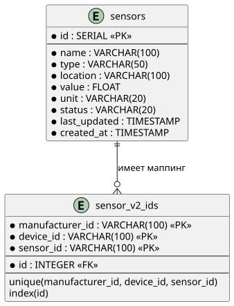

 

Integration Service ER-диаграмма:

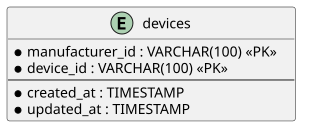

 

# Задание 4. Создание и документирование API

### 1. Тип API

REST API.

### 2. Документация API

- [Auth Service API](./schemas/to-be/api/auth-service.yaml)
- [Devices Service API](./schemas/to-be/api/devices-service.yaml)
- [Actions Service API](./schemas/to-be/api/actions-service.yaml)
- [Automations Service API](./schemas/to-be/api/automations-service.yaml)
- [Sensors Service API](./schemas/to-be/api/sensors-service.yaml)
- [Integration Service API](./schemas/to-be/api/integration-service.yaml)

# Задание 5. Работа с docker и docker-compose

- [apps/temperature-api/Dockerfile](./apps/temperature-api/Dockerfile)
- [apps/docker-compose.yml](./apps/docker-compose.yml)

# **Задание 6. Разработка MVP**

- [apps_v2](./apps_v2/)

Интеграция со старым монолитом так обеспечилась:
- авторизацию надстроили сверху.
- оставили старые ручки и старую схему БД, создали новую ручку `/api/v1/devices/{manufacturer_id}/{device_id}/sensors/` и новую таблицу `sensor_v2_ids`, которые конвертят новые id и в старые id для бесшовной миграции.
- отпилили походы в temperature-api, заменили на чтение из kafka (сервис integration-service пишет в kafka).

